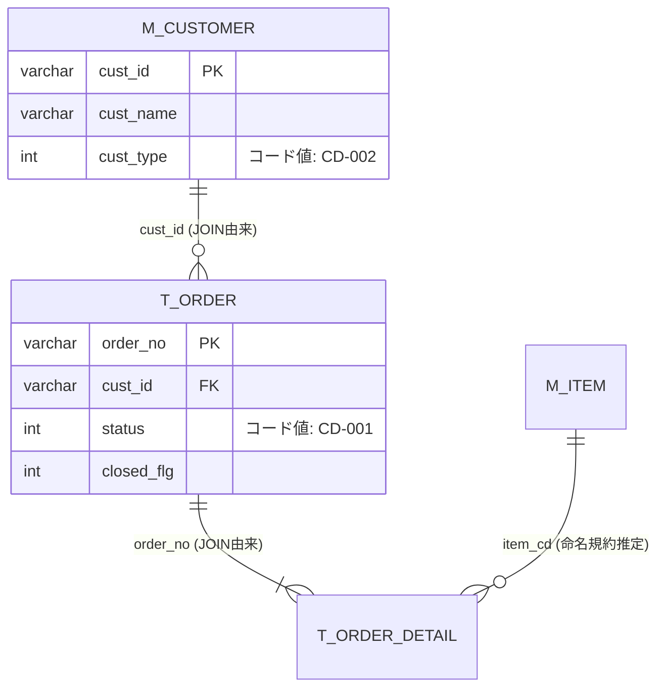

# Output Template — ER図・データディクショナリフォーマット

成果物は 1 つの markdown ファイル(例: `data-dictionary.md`)にまとめる。

確信度は他スキルと共通の 3 値: `確定` / `推測` / `不明`

---

## 1. 調査サマリ

```markdown
# ER図・データディクショナリ — [システム名]

## 調査サマリ

- 調査日:
- スキーマソース: [DDLエクスポート / コードからの推定]
- テーブル数: XX(うち廃止候補 XX)
- 復元した関係: XX(JOIN由来 XX / WHERE突合 XX / 命名規約推定 XX)
- 業務的意味の付与率: XX / XX カラム(確定 XX / 推測 XX / 不明 XX)
- 未入手: [ストアド定義、トリガー定義 等]
```

## 2. ER図(mermaid)

テーブル数が多い場合は業務領域ごとに図を分割する。1 図 10 テーブル程度まで。

````markdown
## ER図

### 受注系


````

表記ルール:

- 関係のラベルに**結合カラムと推定根拠**(JOIN由来 / WHERE突合 / アプリ突合 / 命名規約推定)を書く
- FK は宣言的制約がなくても推定したものに付け、根拠で信頼度を読み分けられるようにする
- コード値を持つカラムはコード値辞書の ID(CD-XXX)をコメントで参照する

## 3. テーブル定義 + データディクショナリ

テーブルごとに 1 セクション。物理定義(事実)と業務的意味(解釈)を同じ表で列を分けて書く。

```markdown
## テーブル定義

### T_ORDER(受注: 推測)

- 用途: 受注のヘッダ情報を保持(推測。根拠: frmOrder の保存先)
- 主な読み書き機能: F-001(C), F-003(R), F-006(U) — CRUDマトリクスより
- 行数規模: 不明(要調査)

| カラム | 型 | NULL | 物理制約 | 業務的意味 | 意味の出典 | 確信度 |
|---|---|---|---|---|---|---|
| order_no | varchar(10) | NO | PK | 受注番号 | frmOrder ラベル「受注No」 | 確定 |
| cust_id | varchar(8) | NO | - | 顧客ID(M_CUSTOMER 参照) | JOIN条件 | 確定 |
| status | int | NO | DEFAULT 1 | 受注ステータス → CD-001 | 表示変換関数 GetStatusName | 確定 |
| closed_flg | int | YES | - | 締め処理済みフラグ(1=済と推測) | mdlBatch の更新箇所 | 推測 |
| reserve1 | varchar(20) | YES | - | 不明(全コードで参照なし) | - | 不明 |
```

- 「意味の出典」は UI ラベル / 帳票項目 / 表示変換関数 / JOIN / 命名のいずれかを必ず書く
- どこからも参照されないカラムは業務的意味を創作せず `不明` とし、廃止候補リストにも載せる

## 4. コード値辞書

```markdown
## コード値辞書

### CD-001: T_ORDER.status(受注ステータス)

| 値 | 意味 | 根拠 | 確信度 |
|---|---|---|---|
| 1 | 受付 | GetStatusName の変換テーブル | 確定 |
| 2 | 引当済 | 同上 | 確定 |
| 3 | 出荷済 | 同上 | 確定 |
| 9 | 不明(分岐は存在: 帳票出力をスキップ) | frmReport の If 文のみ。表示名なし | 不明 |

- 網羅性の注意: 実データには上記以外の値が存在しうる(DISTINCT 調査を推奨 → 要調査 #X)
```

## 5. 暗黙の整合性ルール

アプリ側でのみ守られている制約。データ移行設計の必須インプット。

```markdown
## 暗黙の整合性ルール(アプリ側でのみ担保)

| # | ルール | 実装箇所 | DB制約の有無 | BR-ID | 確信度 |
|---|---|---|---|---|---|
| 1 | order_no は年度+連番で一意(UNIQUE 制約なし) | mdlNumbering.bas: GetNextNo | なし | BR-001-05 | 確定 |
| 2 | T_ORDER 削除時に T_ORDER_DETAIL をアプリ側で削除(FK なし) | frmOrder: cmdDelete_Click | なし | - | 確定 |
```

`legacy-business-rules` の成果物があれば BR-ID で紐付ける。

## 6. 廃止候補リスト / 要調査リスト

```markdown
## 廃止候補リスト

| 対象 | 種類 | 根拠 | 注意 |
|---|---|---|---|
| T_OLD_IMPORT | テーブル | 全コードで参照なし | 他システム利用の可能性あり。実データの更新日時を確認 |
| T_ORDER.reserve1 | カラム | 全コードで参照なし | 同上 |

## 要調査リスト

| # | 事項 | なぜコードから判断できないか | 推奨される調査方法 |
|---|---|---|---|
| 1 | スキーマの正確な型・制約 | コードからの推定のため | DB からの DDL エクスポートを依頼 |
| 2 | CD-001 の値 9 の意味と実在 | 表示名がコードに存在しない | 実データの DISTINCT + 利用部門確認 |
| 3 | 各テーブルの行数規模 | コードに現れない | 本番 DB の件数調査(非機能要件の根拠にもなる) |
```
