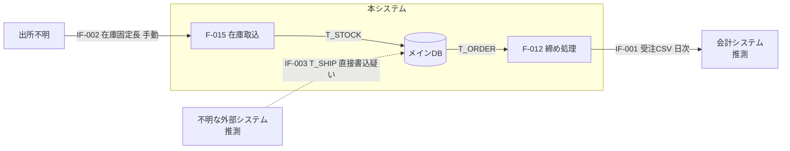

# Output Template — データフロー図・外部連携一覧フォーマット

成果物は 1 つの markdown ファイル(例: `data-flow.md`)にまとめる。

確信度は他スキルと共通の 3 値: `確定` / `推測` / `不明`

---

## 1. 調査サマリ

```markdown
# データフロー図・外部連携一覧 — [システム名]

## 調査サマリ

- 調査日:
- 連携数: XX(IN XX / OUT XX / 双方向 XX)
- 種類別: ファイル XX / ネットワーク XX / メール XX / 外部プロセス XX / 共有DB疑い XX
- 相手システム(推定): [一覧]
- 設定依存の接続先: XX 件(実環境値が未確認)
```

## 2. 外部連携一覧

```markdown
## 外部連携一覧

| ID | 名称(推定) | 方向 | 種類 | 契機(機能ID) | 頻度の手がかり | 接続先/パス | 相手(推定) | フォーマット | エラー時挙動 | 確信度 | 備考 |
|---|---|---|---|---|---|---|---|---|---|---|---|
| IF-001 | 会計システム向け受注データ出力 | OUT | ファイル(CSV) | F-012 締め処理 | ファイル名に YYYYMMDD → 日次と推測 | \\KEIRI-SV\import\juchu_YYYYMMDD.csv | 会計システム(パス名より推測) | LAYOUT-01 | On Error Resume Next 配下。失敗を検知しない | 確定 | 出力先の実在は未確認 |
| IF-002 | 在庫データ取り込み | IN | ファイル(固定長) | F-015(取込ボタン) | 手動 | C:\import\zaiko.dat | 不明(誰が置くか不明) | LAYOUT-02 | 形式エラー時は行スキップ(メッセージなし) | 確定 | 設置者の調査が必要 |
| IF-003 | (共有DB)T_SHIP への書き込み元 | IN | 共有DB疑い | - | - | メインDB T_SHIP | 不明 | - | - | 推測 | どの機能も書かないのに読まれている |
```

記載ルール:

- 名称は内容からの推定でよいが、根拠(ファイル名・パス)を備考に残す
- 接続先が設定値の場合は `設定: <キー名>(実環境値は要調査)` と書く
- 共有 DB 疑い(Phase 5 で検出)も IF として採番し、種類を `共有DB疑い` とする

## 3. ファイルレイアウト定義

```markdown
## ファイルレイアウト定義

### LAYOUT-01: 会計向け受注CSV(IF-001)

- 形式: CSV、カンマ区切り、ヘッダ行なし、引用符なし
- 文字コード: Shift_JIS(VB6 デフォルト。明示指定なし → 推測)
- 改行: CRLF
- 復元元: mdlExport.bas: ExportToKeiri

| # | 項目(推定) | 出力元(テーブル.カラム) | 形式・編集 | 確信度 |
|---|---|---|---|---|
| 1 | 受注番号 | T_ORDER.order_no | そのまま | 確定 |
| 2 | 受注日 | T_ORDER.order_date | Format("yyyymmdd") | 確定 |
| 3 | 金額 | T_ORDER.total_amount | 整数(円未満なし) | 確定 |
| 4 | 固定値 "01" | (リテラル) | 意味不明 | 不明 |
```

- 固定長の場合はオフセット・長さ・バイト/文字単位を明記する
- 出力される固定値・空項目も省略せず書く(相手側の仕様の痕跡であるため。意味は不明でよい)

## 4. データフロー図(mermaid)

外部実体(相手システム)・プロセス(機能群)・データストア(テーブル群)の 3 要素で書く。連携が多い場合は相手システムごとに分割する。

````markdown
## データフロー図


````

表記ルール:

- エッジラベルに `IF-ID + 内容 + 頻度` を書く
- 確信度が `推測` の連携は点線(`-.->`)、相手不明の外部実体は `不明` `出所不明` と明記する
- データストアは `[( )]` で表す

## 5. 要調査リスト

```markdown
## 要調査リスト

| # | 事項 | なぜコードから判断できないか | 推奨される調査方法 |
|---|---|---|---|
| 1 | IF-001 の出力先が現在も読まれているか | 相手側の実態はコードに現れない | \\KEIRI-SV の実フォルダ確認 / 会計側担当へ確認 |
| 2 | IF-002 のファイルを誰が設置するか | 手作業 or 他システムか判別不能 | 運用担当へ確認 / フォルダの更新履歴調査 |
| 3 | IF-003 T_SHIP の書き込み元システム | このコードベース外 | DB の監査ログ / 接続元調査 |
| 4 | 設定キー ExportPath の実環境値 | 設定ファイルの本番値が未入手 | 本番環境の設定ファイル取得 |
```
