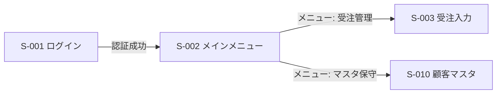
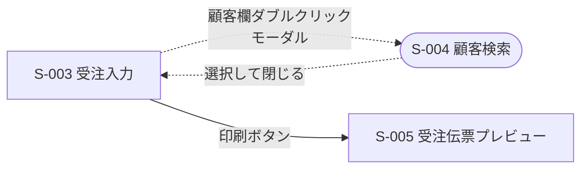

# Output Template — 画面一覧・画面遷移図フォーマット

成果物は 1 つの markdown ファイル(例: `screen-flow.md`)にまとめる。

確信度は他スキルと共通の 3 値: `確定` / `推測` / `不明`

---

## 1. 調査サマリ

```markdown
# 画面一覧・画面遷移図 — [システム名]

## 調査サマリ

- 調査日:
- 画面数: XX(メニュー XX / 入力 XX / 照会・検索 XX / ダイアログ XX / 帳票プレビュー XX)
- 遷移数: XX(モーダル XX / モードレス XX)
- 孤立画面: XX(動的呼び出しの疑い XX / デッドスクリーン候補 XX)
- 起点画面: [起動フォーム名]
```

## 2. 画面一覧

```markdown
## 画面一覧

| ID | 画面名 | 種別 | 定義ファイル | 機能ID | 呼び出し元画面 | 確信度 | 備考 |
|---|---|---|---|---|---|---|---|
| S-001 | ログイン | 入力 | frmLogin.frm | F-001 | (起動) | 確定 | |
| S-002 | メインメニュー | メニュー | frmMain.frm | - | S-001 | 確定 | MDI親 |
| S-003 | 受注入力 | 入力 | frmOrder.frm | F-002〜F-005 | S-002 | 確定 | |
| S-004 | 顧客検索 | ダイアログ | frmCustSearch.frm | F-006 | S-003, S-007 | 確定 | モーダル。選択結果を呼出元に返す |
```

- 画面名はフォームタイトル(Caption / Text)由来を `確定`、クラス名からの推測を `推測` とする
- 複数画面から呼ばれる共通ダイアログは呼び出し元をすべて列挙する

## 3. 画面遷移図(mermaid)

画面数が多い場合は業務領域ごと(メニューのサブツリーごと)に図を分割する。1 図 15 画面程度まで。

````markdown
## 画面遷移図

### 全体(メニュー階層)



### 受注管理系


````

表記ルール:

- エッジラベルに**契機**(メニュー名・ボタン名・操作)を書く
- モーダル遷移は点線(`-.->`)+ ノードを `([ ])` 角丸で表す。モードレスは実線(`-->`)
- 条件付き遷移は契機に条件を併記する(例: `保存ボタン(権限=管理者のみ)`)
- 推測の遷移(動的呼び出しを推定で結んだもの)はラベルに `(推測)` を付ける

## 4. 孤立画面リスト

```markdown
## 孤立画面リスト

| 画面ID | 画面名 | 判定 | 根拠 |
|---|---|---|---|
| S-021 | 旧形式インポート | デッドスクリーン候補 | 全ソース grep で参照ゼロ。メニューにも項目なし |
| S-022 | 進捗表示 | 動的呼び出しの疑い | フォーム名の文字列リテラルが mdlCommon.bas にあり |
```

## 5. 要調査リスト

```markdown
## 要調査リスト

| # | 事項 | なぜコードから判断できないか | 推奨される調査方法 |
|---|---|---|---|
| 1 | S-021 が本当に未使用か | 静的解析では利用実態を判別不能 | 利用部門への確認 / 実機のメニュー表示確認 |
| 2 | 権限テーブルによるメニュー表示制御の実態 | M_AUTH の実データに依存 | 本番 DB の M_AUTH を確認 |
```
